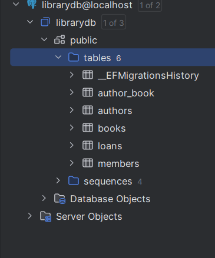
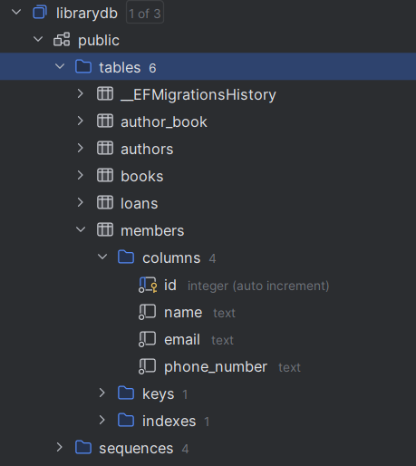

# Library System v0

This project is an examination in EF Core and the skills to create
a database using a code-first approach.

The application is a console application, so I can focus on the core
mechanics of EF Core.

This document is written in a manner to display the progression of
the project.

### Requirements and packages

- .NET 9.x
- Microsoft.EntityFrameworkCore.Design --version "9.*"
- Npgsql.EntityFrameworkCore.PostgreSQL --version "9.*"
- EFCore.NamingConventions --version "9.*"
- Docker Desktop

## Starting point

In this project I design a system for an imaginary library. Since I like books
it feels like a good choice.

### The system requires the following

Tables to store information about:

Author:

- Id
- Name
- Authors can have many books

Book:

- Id
- Title
- Isbn
- Publish date
- Books can have one or more authors

Member:

- Id
- Name
- Email
- PhoneNumber
- Members can have many loans

Loan:

- Id
- BookId
- MemberId
- Start date
- End date
- Loan can have one book and one member

## First migration

The initial code-first migration was applied successfully, creating all
tables and relationships in the database.




## Second migration

After the initial migration, Fluent API was added to explicitly configure
constraints and relationships.

```csharp
Example

// author
modelBuilder.Entity<Author>()
.HasKey(a => a.Id);

        modelBuilder.Entity<Author>()
            .Property(a => a.Name)
            .HasMaxLength(100)
            .IsRequired();

        modelBuilder.Entity<Author>()
            .HasMany(b => b.Books)
            .WithMany(b => b.Authors);
```

In this example, constraints have been added to the Author entity, specifying
a maximum length for the Name property and that it is required.
The relationship is also configured so that an Author can have many Books,
and a Book can have more than one Author.

## Third migration

A third migration was created to extend the Book entity with a loan status flag.

A boolean property `IsOnLoan` was added to track whether a book is currently loaned
or available.

This was implemented to support loan logic.

## Console menu

Menu is structured around the most common user action (loan and return) to reflect
real-world usage.

This project is implemented as a console application intended for single-user usage.

Async/await has therefore not been used, since there is no practical benefit in this
context. The application runs sequentially and waits for user input between operations.

The domain logic is separated from the presentation layer, making it possible to add
a GUI in the future if needed.

## Queries, projection and aggregation

To optimize read operations, projection is used with Select() to only retrieve
required data.

```csharp
Example

var books = dbContext.Books
            .AsNoTracking()
            .Select(b => new
                {
                    b.Id,
                    b.Title,
                    b.Isbn,
                    b.PublishDate,
                    b.IsOnLoan,
                    Authors = b.Authors.Select(a => a.Name).ToList()
                })
            .ToList();
```

This avoids loading unnecessary navigation properties and improves performance.

An aggregation function is to count active loans.
```csharp
Example

return dbContext.Loans.Count(l => l.Book.IsOnLoan);
```

## Explicit transaction

An explicit transaction is used when loaning a book.

This operation involves multiple related updates:
- Creating a loan record
- Updating Book.IsOnLoan

To ensure data consistency, both operations are wrapped in a transaction.

```csharp
Example

using var transaction =  dbContext.Database.BeginTransaction();

try
{
    book.IsOnLoan = true;
    dbContext.Loans.Add(loan);
    dbContext.SaveChanges();
    
    transaction.Commit();
}
catch
{
    transaction.Rollback();
    throw;
}
```

This guarantees that either both changes are saved or none.

## How to run

Unzip the file.

Type this in the root folder in your CLI of choice:

```bash
docker compose up -d
```

To start the database. Make sure Docker desktop is running first.

Then type in the same folder in the CLI:

```bash
dotnet restore
dotnet ef database update
dotnet run
```

In the menu, you have the choice to load testdata to demo the application with.

## Final notes

This project was developed as part of an examination in EF Core, with focus on
understanding database design, migrations, and data access.

Throughout the project, emphasis was placed on structure, readability, and gradual
improvement through refactoring and testing.

The result is a functional console-based library system that meets the course
requirements and reflects my learning process during the development.

God speed.